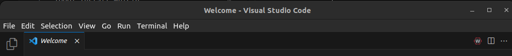
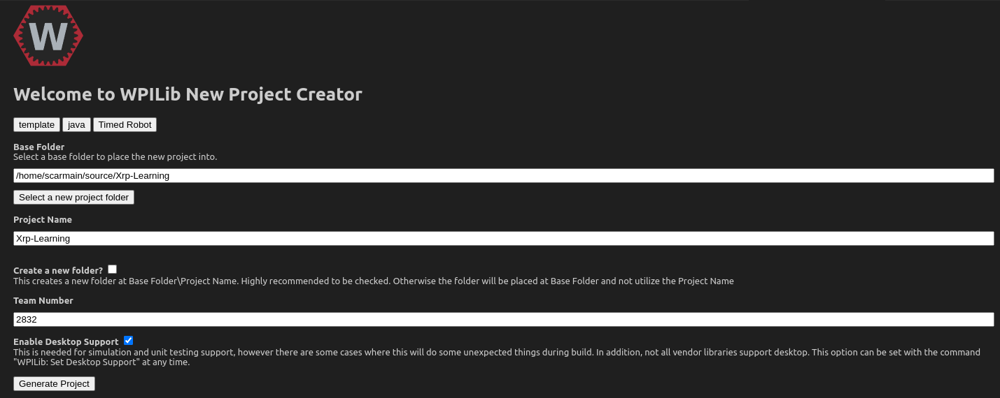

TODO: Install WpiLib

To start developing for the XRP robot, we first need to create a project.  To do this click the W WpiLib logo in the top right.

There will be a drop down window, and you want to select `WPILib: Create a new project`.

At the top, you want to select Template, then Java, then Timed Robot.  This is the basic template for us to work with.  Then select a base folder to store everything in, name your project, and put in a team number.  (The team number does not matter for this demo.)  We also need to enable desktop support, as the XRP robot uses Desktop mode to run the robot.  Your computer is the device actually running the code, and the XRP just replays the commands.



There are a couple other setup steps we need to do.  We need to add these lines to the end of the build.gradle file:
```
//Sets the XRP Client Host
wpi.sim.envVar("HALSIMXRP_HOST", "192.168.42.1")
wpi.sim.addXRPClient().defaultEnabled = true
```

We also need to add the XRP library to our project.  To add this, click the WpiLib logo, and hit Manage Vendor Libaries.  Then hit install new library (online).  Then, when it asks for a url, use `https://raw.githubusercontent.com/wpilibsuite/allwpilib/main/xrpVendordep/XRPVendordep.json`, and hit yes to rebuild the code.