# Controlling the Robot

TODO: Explain the sections of the robot code (all the inits/periodics, and the stages like auto/teleop/robot)

We are going to start with the basic robot template here, and only be modifying src/main/java/frc/robot/Robot.java to start.

## Driving the Robot
To start controlling the robot, we need to create motor classes to command the motor.  These are the `XRPMotor` class.  This encapulates all the functionality of the XRP motor.  To create these instances of the class, we need to declare them at the top of the Robot class:

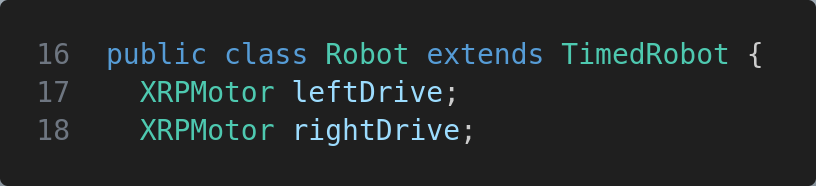

Then, we need to initialize the motors to specify what ports they are plugged into.  This is the table of ports as labeled on the red circuit board and their associated IDs:

| ID | Location |
| -- | -------- |
| 0 | Motor L |
| 1 | Motor R |
| 2 | Motor 3 |
| 3 | Motor 4 |

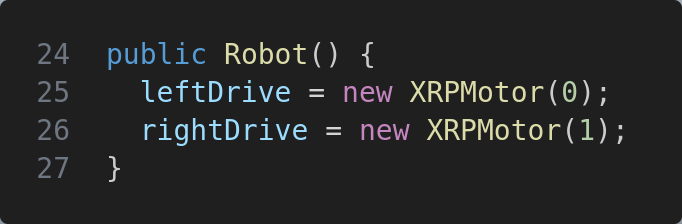

Finally, we need to command the motors to drive.  Since this command runs without any conditions currently, we will put it in the autonomous periodic section.  By using the `XPRMotor.set()` command, we can set how much power we give the motors, between -1 to 1.  This is a decimal percentage number, so 0.5 would mean 50% power.

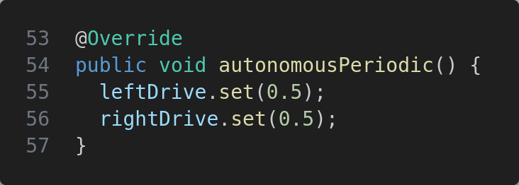

This should be enough code to have the robot drive forward at 50% power.  Run the robot and see what happens...

Did your robot drive to the right?  It should have.  This is because almost all tank-style robots like the XRP have the right motors mounted inverted from the left side.  To fix this, in the initialization section, let's make the right motor drive inverted.  To do this, we will use the `XRPMotor.setInverted()` function to invert our motor.  Now, try this again, and our robot should drive straight.

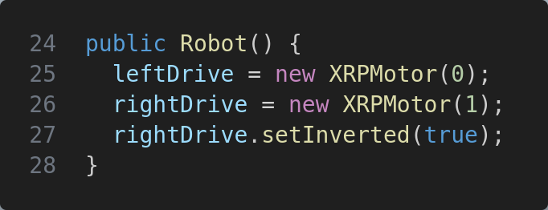

## Using a controller
Having the robot drive by itself is only so much fun, what if we can control it by a controller?  To do that, we are going to have to create a controller object.  We are using the XboxController as it's the most common controller.  This helper class already has all the buttons and joystick axis mapped for us.

To create the controller, we are going to use port 0 to initialize it.  The driver station supports 6 controllers, starting with ID 0.

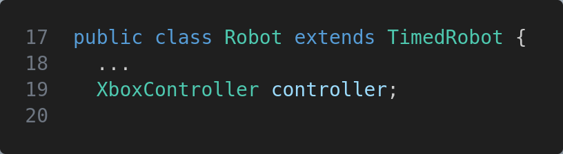
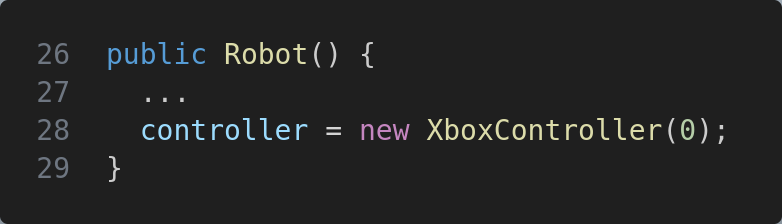

Once we have the controller initiaized, we want to use it.  Most teams use the left stick forwards/backwards (aka the Y axis) to drive.  The controller will give a percentage value between -1 to 1, just like the motor commands, so we can use this as the speed to command our motors.

We will use teleopPeriodic to handle the drive code.  Since the controllers are only usable in teleop, this makes the most sense.  First, we will read the controller value as the speed value using `controller.getLeftY()`, then we will command both motors with this value.

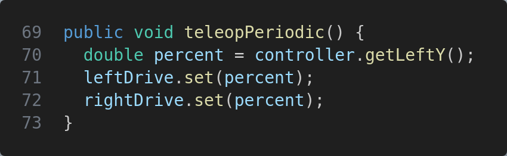

Now we should be able to drive the robot forward and backwards.  Let's run the robot and see what happens.  What way does the robot drive?

By default, Xbox controllers have forward on the sticks as negative values.  You can verify this in the simulation.  To fix this, we just need to invert the percent command.

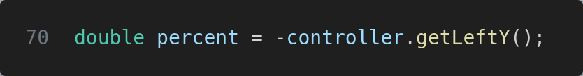

We will implement turning later.

## Using the servo
On the XRP robot, there is a servo mounted to an arm to allow for positional control.  Servos allow for repeatable control to a position.  Internally, the servo has a motor and a position sensor, and uses a PID loop to keep the arm at a position.

To create a servo object, we will use the XRPServo class to command the servo.  We will use ID 4, as that was configured for Servo 1, and ID 5 is Servo 2.  (This is because there are 4 motor channels that were numbered first.)  This snippet of code will initialize the servo.

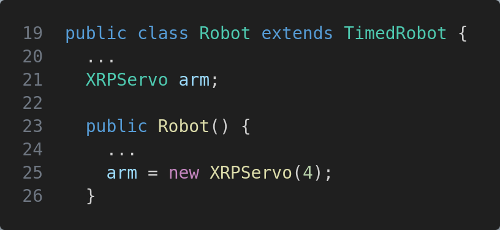

This logic in the periodic shows the advantage of using a servo.  With this logic, we would set the position of the servo at 25% with an A button press, 75% with the Y button, or use the right trigger to adjust the arm however we want.  Notice every time you press the button, it should go to the same spot each time.

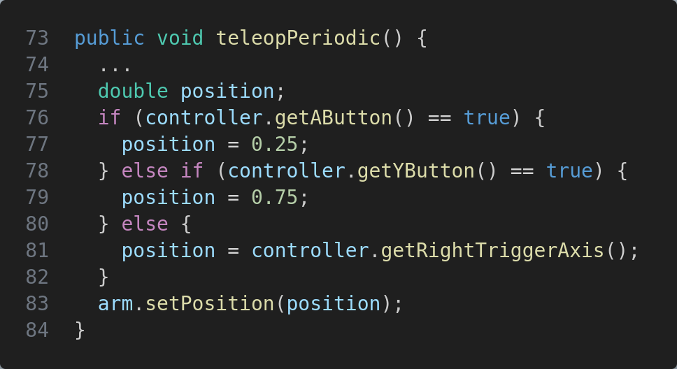

## Making the robot turn
WpiLib provides a class that will drive a robot built in this style (aka a differential drive robot).  These robots drive by running both motors forward/backwards, and turn by driving one motor forward with the other backwards.

First, we need to allocate a differential drive object from WpiLib:
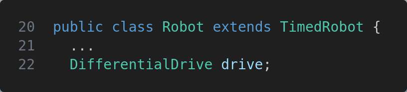

Then we need to initialize the class.  We need to pass in a left and right motor to tell the class what motors to command.  [Note1](#note1)
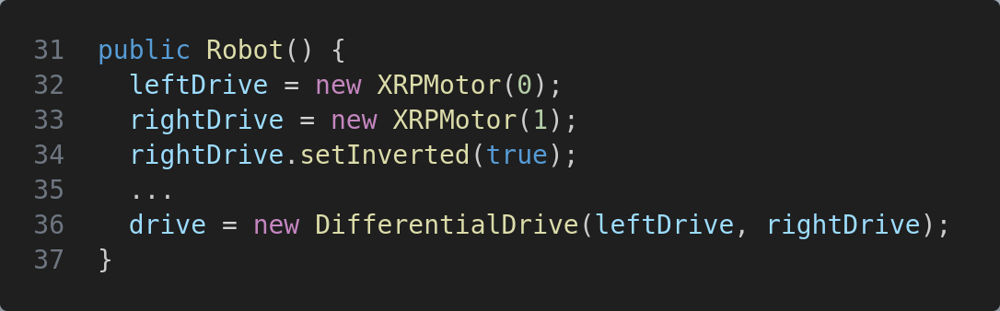

Finally, we need to use it to drive.  We will have to get a turn value also.  Note the turn axis needs to be inverted for the same controller axis definitions.
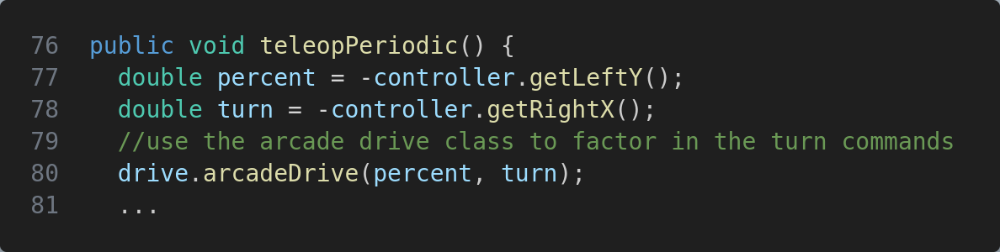

## Full Code Example
This shows all the sections we modified.  It has truncated some of the irrelevant logic for this example in Robot.java.
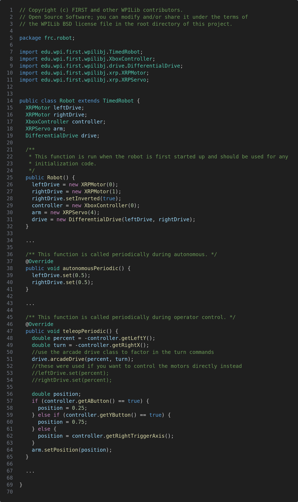

### Note1
The motors used to implement DifferentialDrive need to implement the WpiLib MotorController class, which some of the 3rd party controllers don't.  Also, if there are more motors per side, you can use the MotorContoller.addFollower() function to group them together.  XRP robots do not need to worry about this.

TODO: Show how to connect the joysticks in simulation.

Make sure the joysticks are plugged in.  If not, you will see these errors appearing in the error terminal.  
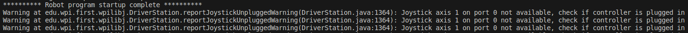